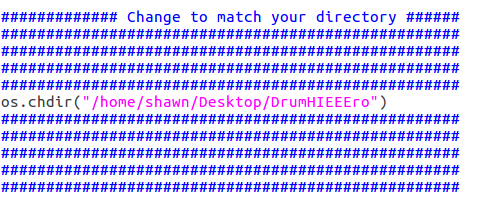
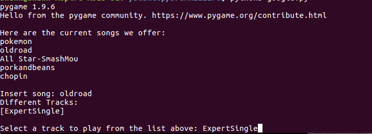
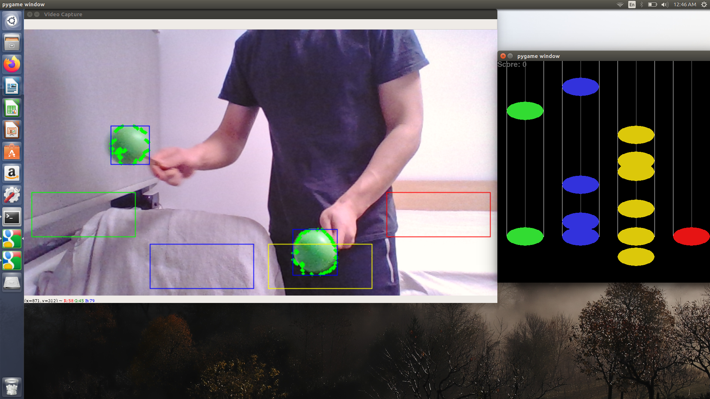

# Drum-HIEEEro
### Guitar Hero based Webcam Game Created with Python's OpenCV and Pygame libraries
##### Created with Martyn Wei and Martin Ffrench
In order to play the game, perform the following steps after cloning the repo (images not needed):

1. Acquire Green Balls that will act as drum heads (eg. tennis balls, stress balls). Other colours will work too, just play around with the self.lower_colour(50,0,0) and self.upper_colour(70,255,255). [G B R] colour coded.

2. Change the one line in main.py to match your current directory. Then run by entering `python3 main.py` in terminal.

3. Select Song and Difficulty.

4. The song will start and the notes will drop! Have fun Drumming!

